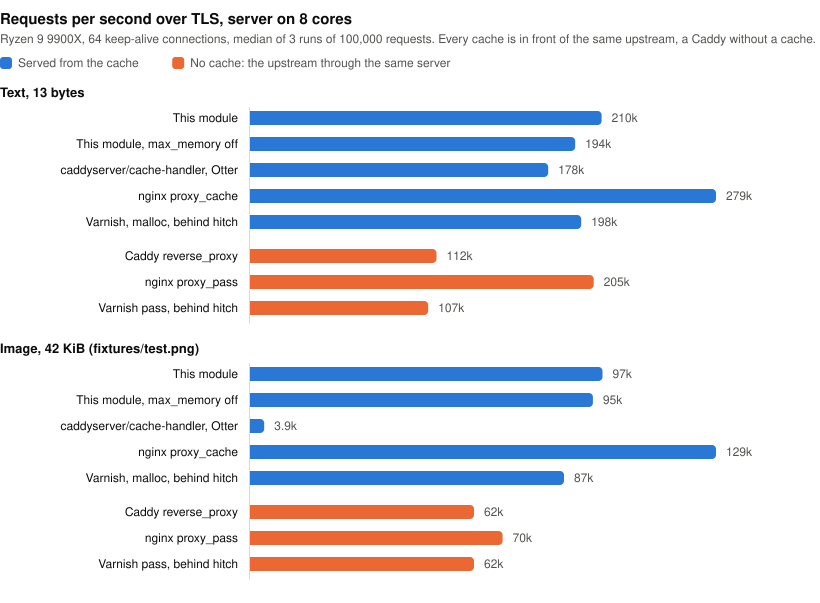

Caddy Module: http.handlers.cache
================================

A simple streaming HTTP caching module for Caddy, based off [caddyserver/cache-handler](https://github.com/caddyserver/cache-handler).

It works the way nginx's `proxy_cache` does: responses are stored as files in a directory of bounded size, and the most requested ones are also kept in memory, within a strict budget. Responses are streamed, on their way into the cache as on their way out, and are never held whole in memory.

> [!IMPORTANT]
> This is not a drop-in replacement for [caddyserver/cache-handler](https://github.com/caddyserver/cache-handler). That module is built on [Souin](https://github.com/darkweak/souin) and its pluggable storage backends; this one replaced all of that with a single built-in storage, and dropped the features that depended on it. **Stay on the original module if you need any of the following:**
>
> * **A cache shared by several Caddy instances.** Souin can store in Redis, etcd, NATS or Olric, so that a cluster shares one cache and one purge. Here every instance has its own cache on its own disk.
> * **Purging by tag.** Souin groups responses under surrogate keys (`Surrogate-Key`, `Cache-Tags`…) and purges a group at once, optionally propagating the purge to a CDN (Fastly, Cloudflare, Akamai). Here a purge is by key, prefix or regular expression.
> * **ESI.** Souin processes `<esi:include>` tags. This module does not.
> * **Caching `POST` requests or GraphQL.** Souin can cache other methods and make the request body part of the key. Here only `GET` is cached.
> * **A storage of your choice**, such as a purely in-memory cache (Otter) or an embedded database (Badger, NutsDB).
> * **Prometheus metrics** from the cache itself. Here the counters are served as JSON by the admin endpoint.
> * **A track record.** Souin has years of production use and is tested against the HTTP caching conformance suite. This module is new.
>
> This module is the better fit when what you cache is large or numerous and the server has finite memory: images, video, downloads, an object storage behind a reverse proxy.

## Comparison

| | This module | [caddyserver/cache-handler](https://github.com/caddyserver/cache-handler) (Souin) | nginx `proxy_cache` |
|---|---|---|---|
| Storage | Files on disk, plus the hottest responses in memory. Built in. | Pluggable: Badger, NutsDB, Otter, SimpleFS, Redis, etcd, NATS, Olric. Each is a separate module to build in; without one, an in-memory map. | Files on disk; RAM through the page cache of the kernel. |
| Disk limit | `max_size` and `max_file_count`, enforced, downloads in progress included. | Depends on the storage. | `max_size`, enforced periodically by the cache manager. |
| Memory limit | `max_memory`, enforced: index and in-memory responses, held outside the Go heap. | None for the handler: each response in transit is buffered whole, several times over. The default storage is unbounded. | `keys_zone` for the index; the page cache is the kernel's. |
| Response bodies | Streamed through the cache file, a few tens of kilobytes of buffer per request whatever the size. | Buffered whole in memory before the client gets the first byte, and again on every hit. | Streamed, buffered to a temporary file. |
| Large files | Fine: bounded by disk only. | Bounded by RAM, times the number of concurrent requests. | Fine. |
| Concurrent requests for a missing response | One upstream request; the others are served from it as it arrives, whatever the speed of the first client. | One upstream request; the others get the response once it is complete. | With `proxy_cache_lock`, the others wait for the complete response, or for a timeout. |
| `Range` request for a missing response | Streamed as the response arrives, while the whole response is stored. With `slice`, only the part of the response the range is in is fetched and stored. | Served once the whole response is buffered. | The whole response is fetched; ranges can be fetched and cached individually with the `slice` module. |
| Client disconnects during a download | The download continues and is stored, if its length is known. | The download is aborted, nothing is stored. | The download continues and is stored. |
| Expired responses | Revalidated with a conditional request; optionally served stale meanwhile or on error. | Revalidated; optionally served stale. | Refetched, or revalidated with `proxy_cache_revalidate`; optionally served stale. |
| Restart | The cache is kept, and usable at once. | Depends on the storage. | The cache is kept. |
| Responses requested once | With `min_uses 2`, kept in memory and never written to disk. | Written to the storage. | With `proxy_cache_min_uses 2`, not cached: the second request goes to the upstream too. |
| Shared between instances | No. | Yes, with a distributed storage. | No. |
| Purge | By key, prefix or regular expression, on the admin endpoint. | By key, regular expression or surrogate key, with CDN propagation. | By key in the commercial version, or with third-party modules. |
| Cached methods | `GET` (and `HEAD` from it). | Configurable, including `POST` with the body in the key. | Configurable. |
| ESI, GraphQL | No. | Yes. | SSI. |
| Request `Cache-Control` | Ignored by default, honoured with `mode strict`. | Honoured by default. | Ignored. |
| Metrics | JSON counters on the admin endpoint. | Prometheus. | `$upstream_cache_status` in logs. |
| Maturity | New. | Years of production use. | Decades. |

Known limits of this module, besides what the notice above lists:

* Unless `slice` is set, a large file is always downloaded from its beginning: a request for a range far into a response that is not cached yet waits until the download reaches it. See [Slices](#slices).
* The request that triggers a download is held open until the download ends, even if it asked for a range that ends earlier. Its bytes are sent as soon as they arrive; requests arriving meanwhile are not affected. With `slice`, what it waits for is the end of the slice it was reading.
* Slices are fetched one after the other, as the client reads them, never ahead of it.
* Requests are only served from a download in progress when the response announces its length. Others wait for the complete response.
* The cache directory belongs to one Caddy process.
* Linux, macOS and the BSDs only, see [Platform notes](#platform-notes).

## Features

* Two storage tiers, both bounded: `max_size` on disk, `max_memory` in RAM. The number of files can be bounded too, with `max_file_count`.
* Responses are streamed to the client and to the cache at the same time. A body is never buffered whole in memory, whatever its size.
* Requests arriving while a response is being downloaded are served from it as it arrives: one upstream request, and nobody waits for the end of the download to get its beginning.
* A `Range` request for a response that is not cached is streamed as the response arrives, while the whole response is stored.
* Optionally, large responses are fetched and stored in slices (`slice`), like nginx's `slice` module does: seeking into a video that is not cached fetches what is watched, not everything before it.
* A response keeps being stored when the client that asked for it disconnects.
* The cache survives restarts and crashes: files are written atomically and the index is rebuilt from them in the background.
* Optionally, a response is only written to disk once it is requested again (`min_uses`), and served from memory until then: the many responses that are requested once and never again cost no disk write.
* Expired responses are revalidated with `If-None-Match` / `If-Modified-Since` instead of being downloaded again, and can be served stale while they are updated or when the upstream fails.
* `Range`, `If-None-Match`, `If-Modified-Since` and `HEAD` requests are answered from the cache.
* `Vary` support, with `Accept-Encoding` normalized so that compressed variants are not multiplied.
* Sets the [`Cache-Status`](https://www.rfc-editor.org/rfc/rfc9211) and `Age` response headers.
* Statistics and purge on Caddy's admin endpoint.

## Building

```sh
xcaddy build --with github.com/Meow/cache-handler
```

No other module is needed: the storage is part of this one.

Caddy 2.11.7 or later is required, which takes Go 1.26 or later to build. `xcaddy` builds with the latest release of Caddy unless told otherwise.

## Minimal configuration

```caddy
{
    cache {
        ttl 24h
        max_memory 8Gi
        max_size 25Gi
    }
}

example.com {
    cache
    reverse_proxy your-app:8080
}
```

The `cache` directive is ordered before `rewrite`. The global `cache` block is optional: it sets the defaults every `cache` directive inherits.

## Options

The global option and the directive take the same options. A directive inherits from the global option whatever it does not set itself.

```caddy
cache [<matcher>] {
    path /var/cache/caddy
    max_size 25Gi
    max_memory 8Gi
    max_file_count 1000000
    inactive 30d
    min_uses 2
    slice 16Mi

    ttl 24h
    stale 1h
    lock_timeout 5s
    mode strict
    cache_name Caddy
    default_cache_control "public, max-age=3600"
    max_cacheable_body_bytes 1Gi
    allowed_additional_status_codes 404 410

    key {
        disable_host
        disable_method
        disable_query
        disable_scheme
        disable_vary
        sort_query
        headers Authorization X-Tenant
        template {http.request.uri.path}
        hide
    }
    regex {
        exclude ^/admin/
    }
}
```

| Option | Default | Description |
|---|---|---|
| `path` | `cache` in Caddy's data directory | Directory the responses are stored in. Directives using the same directory share one cache. The directory must be used by one Caddy process only. |
| `max_size` | `10Gi` | Disk space the cache may take. The least recently used responses are removed to stay under it. |
| `max_memory` | `256Mi` | RAM the cache may take, for its index and for the most requested responses. `off` keeps the responses on disk only. |
| `max_file_count` | none | Number of files the cache may hold. The least recently used responses are removed to stay under it. Use it when the filesystem runs out of inodes before it runs out of space, which many small responses can do. |
| `inactive` | none | Removes the responses that were not requested for this long, fresh or not. |
| `min_uses` | `1` | Number of requests after which a response is written to disk. With `2` or more, a response is kept in memory only until it has been requested that many times, and is lost if Caddy stops before. See [Requested once](#requested-once). Not available with `max_memory off`. |
| `slice` | `off` | Size of the ranges a response is asked of the upstream in, each being stored by itself, so that a request for a part of a large response fetches that part only. See [Slices](#slices). The upstream has to support `Range` requests. At least `4Ki`, at most half of `max_size`. |
| `ttl` | `120s` | How long a response is fresh when the upstream does not say (no `Cache-Control: max-age` / `s-maxage`, no `Expires`). |
| `stale` | `0` | How long past its freshness a response may still be served while it is being updated, or when the upstream fails. `Cache-Control: stale-while-revalidate` and `stale-if-error` in a response override it. |
| `lock_timeout` | `5s` | How long a request waits for the upstream to start answering another request for the same response, before going to the upstream itself. |
| `mode` | | Which `Cache-Control` directives are honoured. By default those of the responses, but not those of the requests: a client cannot force its way past the cache. `strict` also honours the requests' (`no-cache`, `no-store`, `max-age`, `min-fresh`, `max-stale`, `only-if-cached`). `bypass_response` ignores the responses' and caches everything for `ttl`. `bypass` and `bypass_request` are accepted as aliases of `bypass_response` and of the default. |
| `cache_name` | `Caddy` | Name of the cache in the `Cache-Status` header. |
| `default_cache_control` | | `Cache-Control` given to the responses that have none. |
| `max_cacheable_body_bytes` | half of `max_size` | Responses with a larger body are relayed without being stored. For a response stored in slices, this is its whole size, and there is no default. |
| `allowed_additional_status_codes` | | Status codes to cache for `ttl`, besides 200, 203, 204, 300, 301 and 308. |
| `key` | | Tunes the cache key, see below. |
| `regex` `exclude` | | Requests whose URI matches are not cached. |

`max_size`, `max_memory`, `max_file_count` and `inactive` belong to the directory: two directives using the same `path` cannot disagree on them. Set them once in the global option, or give each cache its own `path`.

Sizes are a number of bytes or a number with a unit: `k`, `m`, `g`, `t` and `Ki`, `Mi`, `Gi`, `Ti` are powers of 1024, `KB`, `MB`, `GB`, `TB` powers of 1000.

In JSON, the handler is `{"handler": "cache", ...}` and the global options are the `cache` app, with the same option names.

## How it works

### Storage

Every stored response is one file under `path`. It is written to a temporary file while it arrives and renamed into place when it is complete, so that a file is always whole: a crash or an interrupted download leaves nothing behind but a temporary file that is deleted on the next start. Files are never modified afterwards.

An index of the files is kept in memory. On start it is rebuilt by reading the directory in the background; meanwhile, requests find the files that are not indexed yet directly on disk, so the cache is warm immediately.

A response requested at least twice in a few minutes is copied to memory, provided it is requested more than the response it would push out. Responses in memory are still on disk: memory is an accelerator, never the only copy, unless `min_uses` says otherwise.

### Requested once

On most sites, most of the responses a cache stores are requested once and never again. Writing them to disk wears the disk, and competes with the reads that serve the responses people do ask for, to no benefit. This is what Cloudflare [observed](https://blog.cloudflare.com/why-we-started-putting-unpopular-assets-in-memory/) on its own cache, and `min_uses` applies the same remedy.

With `min_uses 2`, a new response is stored in memory only. If it is requested a second time, that request is served from memory, and the response is then written to disk, where it stays like any other. If it is not, it is dropped from memory when the responses that came after it need the room, without ever having touched the disk. A higher value waits for more requests. The requests that are served from a response while it downloads count.

Unlike nginx's `proxy_cache_min_uses`, the response is cached from its first request on: the second request is a hit, not another trip to the upstream. That holds for as long as memory keeps the response, which depends on how much there is and on how fast new responses arrive. Responses waiting for their next request share half of `max_memory`, the least recently requested ones leaving first. A response that left this way is remembered, at a cost of a few bytes: when it is requested again it is fetched again, but this time written to disk. A response requested twice is therefore fetched once in the usual case, and twice otherwise, as it always is by nginx. Only a response that comes back after so long that it has been forgotten starts over.

Some responses are written to disk at their first request as if `min_uses` were not set: those larger than an eighth of `max_memory`, and those arriving when the memory they may use is all taken by other responses that are still downloading. So are the new versions of a response that is already on disk.

What is in memory only does not survive Caddy stopping: after a restart, a response that was requested once is fetched again. A configuration reload keeps everything.

### Limits

`max_size` covers the cache files and the downloads in progress. When a response does not fit, the least recently used ones are deleted to make room. A response larger than half of `max_size` (or than `max_cacheable_body_bytes`) is not stored.

`max_file_count` counts one file per response stored on disk, one more per URL whose responses vary (it records which request headers select them), and one per download in progress. A response stored in slices is one file per slice, and one more for the URL. A download that would exceed it evicts the least recently used response first. Besides these files the cache directory holds up to 258 directories and two small files of its own, which are not counted.

`max_memory` covers the index (about 200 bytes plus the key per file) and the bodies and headers kept in memory. The bodies live outside the Go heap, in memory mapped for that purpose and returned to the system when the budget shrinks, so they do not weigh on the garbage collector. When the index alone approaches the budget, which takes millions of files, the least recently used files are removed. With `min_uses`, the responses that are in memory only, headers included, take at most half of the budget, and the body of one of them at most an eighth; the copies of what is on disk make room for them.

What is not counted is what serving requests takes: a few tens of kilobytes of buffers per request in progress, whatever the size of the response.

### Fetching

On a miss, the response is written to the cache as fast as the upstream sends it, and the client is served from the cache file while it fills, starting with the first bytes. The speed of the client does not matter to the download: a client on a slow connection, or one that stops reading, delays nobody else.

Other requests for the same response do not go to the upstream. They wait, up to `lock_timeout`, for the upstream to start answering the first one, and are then served from the same file, as it fills: a second viewer of a video starts watching while the first download is still in progress, and a request for a range gets it as soon as the download has reached it. This applies to responses that announce their length (`Content-Length`). For the others, which could turn out too large to keep, the other requests wait for the complete response, and go to the upstream themselves after `lock_timeout`.

When the response turns out not to be cacheable, the waiting requests are released at once and, for a minute, requests for it are not made to wait at all. During that minute, requests with a range or a precondition go straight to the upstream as they are.

Unless [slices](#slices) are used, the upstream is always asked for the whole response, whatever the client asked for. When the request that triggers the download asks for a range, it is sent that range as the download reaches it. When it carries a precondition (`If-None-Match`…) or asks for several ranges, the response is stored first and the request answered from it.

If the client disconnects, the download goes on for the benefit of the next requests, provided the response announced its length and for as long as the upstream keeps sending. A response of unknown length is given up when the last client listening to it leaves.

If a download fails midway, nothing is stored, and the requests that were being served from it are cut short rather than given a truncated response as if it were complete. If a response can no longer be stored while it downloads, for lack of space for instance, the client that triggered it still gets all of it.

### Slices

By default the upstream is asked for whole responses, whatever the client asked for. That is the best use of a cache, one request and one file per response, until someone jumps to the middle of a two hour video nobody watched before: the download starts at the first byte, and the viewer waits for it to get there.

With `slice 16Mi`, the upstream is asked for a response 16MiB at a time, with `Range` requests, and each of these slices is stored by itself. A request is answered from the slices that hold what it asks for, taken from the cache or fetched as the client gets to them. A request for a range fetches the slices the range is in and no other, and a response nobody reads to its end is not downloaded to its end. This is what nginx's `slice` module does.

The client sees none of it. It gets the status, the headers and the length of the whole response, or the range it asked for, and `Range`, `If-Range`, the preconditions and `HEAD` requests are answered as they are without slices.

What the previous section says of a response holds for each slice: one request to the upstream however many clients want the slice, all of them served while it downloads, and a download that goes on when its client leaves. That last one now ends with the slice: the following ones are not fetched for a client that is gone. `min_uses` counts the requests for each slice, and each slice expires and is revalidated by itself.

Not everything is stored in slices:

* A response that fits in its first slice is stored whole, exactly as it is without `slice`. The many small files of a site cost nothing more than a `Range` header in the request made for them.
* So is the response of an upstream that ignores `Range` and sends everything, and any response that is not a `206`: an error, a redirect.
* So is a response that something between the cache and the upstream transforms, by compressing it for instance: the ranges of what the upstream sent are not ranges of what the client gets. The cache notices when the first slice arrives without its length, and asks again for the whole response: the first request for such a response costs the upstream two. The variant of the response that is left as it is, for the clients that do not accept compression, is stored in slices beside it.

Caddy's own `encode` is not such a handler: it leaves the response to a `Range` request alone, and with `slice` that is every response of an upstream that supports them. Placed after the cache, which is where it goes unless a `route` block says otherwise, it compresses nothing of what such an upstream sends: the responses are stored in slices, and served, as the upstream sent them. To have them compressed, put `encode` in front of the cache. It then compresses what the cache serves, each time it is served, and leaves alone the ranges the clients ask for:

```caddy
route {
    encode zstd gzip
    cache
    reverse_proxy your-app:8080
}
```

The slices of a response have to be parts of the same thing. They are compared by `ETag`, `Last-Modified` and total size with the first one sent to the client. When a file changes on the upstream while the cache holds slices of it, a response that would be made of both versions is cut short instead, and every slice stored for the URL is discarded, so that the next request gets the new version. Give the responses an `ETag` or a `Last-Modified`: without them, two versions of the same size cannot be told apart.

Choosing the size: a slice is one request to the upstream and one file, which counts towards `max_file_count`. Slices are fetched one after the other as the client reads, so small ones mean many round trips to the upstream. Large ones mean that more is fetched before the byte a range starts at, and after the last byte a client that left was interested in. Between `1Mi` and `16Mi` suits most uses. Changing the size makes the slices already stored useless: they are not served anymore, and leave the cache as the space is needed.

A response stored in slices can be larger than half of `max_size`, and larger than the cache: its least recently read slices make room for the next ones. `max_cacheable_body_bytes`, when set, applies to its whole size.

The size of a response is not kept anywhere but in its slices. A request for a range that starts past the end of the response is therefore sent to the upstream, which answers that it has no such range, before the client is told so.

### Expiry

A response past its freshness is not discarded. The next request for it revalidates it: the upstream is sent the `ETag` and `Last-Modified` of the stored response and, if it answers `304 Not Modified`, the stored response is fresh again without having been transferred. Otherwise the new response replaces it.

With `stale` set, the other requests arriving during this update are served the stale response immediately, and a failure of the upstream (an error before the response, or a 5xx) is answered with the stale response too. Responses marked `must-revalidate`, `proxy-revalidate` or `no-cache` are never served stale.

### What is cached

Only `GET` requests fill the cache; `HEAD` requests are answered from it. A response is stored unless:

* its status is not one of 200, 203, 204, 300, 301, 302, 307, 308, 404, 405, 410, 414, 501 or of `allowed_additional_status_codes`;
* it does not say how long it is fresh and its status is not one `ttl` applies to;
* it has `Cache-Control: no-store` or `private`;
* it has a `Set-Cookie` header, or `Vary: *`;
* the request had an `Authorization` header, and the response has none of `public`, `s-maxage`, `must-revalidate`, and `Authorization` is neither in `Vary` nor in the `key` `headers`;
* it is already expired and has no `ETag` or `Last-Modified` to revalidate it with;
* its body is larger than what may be stored;
* it announces trailers, or is a stream of events (`text/event-stream`).

A successful `POST`, `PUT`, `PATCH` or `DELETE` request removes the response stored for its URI.

The cache stores what the handlers after it produce. Headers set by a directive placed before it, such as `header Cache-Control "public, max-age=31536000"` for the browsers, are given to every response, served from the cache or not: they are not stored and do not decide how long a response is kept.

## Cache key

The default key is `METHOD-SCHEME-HOST-PATH?QUERY`, for instance `GET-https-example.com-/logo.png?v=2`. The path is taken as the client sent it, percent-encoding included. A different key means a different stored response, so the key should contain what makes the response different and nothing else.

| `key` option | Effect |
|---|---|
| `disable_host`, `disable_method`, `disable_scheme` | Leaves that part out of the key. |
| `disable_query` | Leaves the query string out: `/a?x=1` and `/a?x=2` are the same response. |
| `sort_query` | Sorts the query parameters: `/a?x=1&y=2` and `/a?y=2&x=1` are the same response. |
| `headers` | Adds these request headers to the key, as `-Name="value"`. |
| `template` | Replaces the key altogether. Caddy placeholders are supported. Build it from parts that cannot be mistaken for one another: with `{path}-{query}`, `/a-b` and `/a?b` are the same key. |
| `disable_vary` | Ignores the `Vary` header of the responses. |
| `hide` | Does not show the key in the `Cache-Status` header. |

The key is computed before the request is rewritten. When several URLs are rewritten to the same upstream object, build the key from what identifies the object so that they share one stored response:

```caddy
@image path_regexp image ^/img/download/(.+)/([0-9]+).*\.([A-Za-z0-9]+)$
cache @image {
    key {
        template {re.image.1}/{re.image.2}.{re.image.3}
    }
}
rewrite @image /bucket/images/{re.image.1}/{re.image.2}/full.{re.image.3}
reverse_proxy s3.example.com
```

Responses with a `Vary` header are stored once per combination of the request headers they list. An upstream that sends `Vary: Origin` to every browser, as object storages with CORS enabled do, makes one copy per origin: use `disable_vary` if the response does not actually depend on it.

## The Cache-Status header

| Value | Meaning |
|---|---|
| `Caddy; hit; ttl=3541; detail=MEMORY` | Served from memory, fresh for 3541 more seconds. |
| `Caddy; hit; ttl=3541; detail=DISK` | Served from disk. |
| `Caddy; hit; ttl=-12; detail=UPDATING` | Served stale while another request updates it. |
| `Caddy; fwd=uri-miss; stored` | Fetched from the upstream and stored. |
| `Caddy; fwd=uri-miss; collapsed` | Served from the response another request was fetching from the upstream. |
| `Caddy; fwd=uri-miss; detail=<REASON>` | Fetched from the upstream and not stored: `NO-STORE`, `PRIVATE`, `SET-COOKIE`, `VARY-STAR`, `AUTHORIZATION`, `UNCACHEABLE-STATUS`, `EXPIRED`, `TOO-LARGE`, `TRAILER`, `EVENT-STREAM`, `UNCACHEABLE` (found so less than a minute ago), `HEAD`, `LOCK-TIMEOUT`, `CLIENT-GONE`, `STORAGE-ERROR`. |
| `Caddy; fwd=stale; fwd-status=304; detail=REVALIDATED` | Expired, confirmed by the upstream, served from the cache. |
| `Caddy; fwd=stale; stored` | Expired, replaced by a new response from the upstream. |
| `Caddy; fwd=stale; fwd-status=503; detail=STALE` | Expired and served anyway because the upstream failed. |
| `Caddy; fwd=bypass; detail=<REASON>` | Not handled by the cache: `UNSUPPORTED-METHOD`, `EXCLUDED`, `INVALID-KEY`, `REQUEST-NO-STORE`, `ONLY-IF-CACHED`, `UNAVAILABLE`. |

The key follows as `; key=...` unless it is hidden.

For a response stored in slices, the header tells how the first slice sent to the client was come by. The following ones may have been fetched from the upstream when it says `hit`, and the other way around.

## Admin API

The cache is observed and purged through [Caddy's admin endpoint](https://caddyserver.com/docs/api), `localhost:2019` by default.

```sh
# State of the caches: entries, bytes on disk and in memory, hits, misses, evictions…
# With min_uses: transient_entries are in memory only, persisted counts the responses
# written to disk at a later request, dropped those that never were.
curl localhost:2019/cache/stats

# Remove the response stored for a key, as shown in Cache-Status, with all its
# variants and slices
curl -X POST 'localhost:2019/cache/purge?key=GET-https-example.com-/logo.png'

# Remove the responses whose key starts with a prefix, or matches a regular expression
curl -X POST 'localhost:2019/cache/purge?prefix=GET-https-example.com-/img/'
curl -X POST --data-urlencode 'regex=\.css$' -G 'localhost:2019/cache/purge'

# Empty the caches
curl -X POST 'localhost:2019/cache/purge?all=true'
```

With several caches, add `path=<directory>` to purge one of them only.

## Performance

Over TLS, which is how responses reach browsers, this module serves about three quarters of the requests per second nginx's `proxy_cache` does, as many as Varnish, and far more than the module it is forked from on anything larger than a few bytes. A cached response costs about what Caddy takes to produce a trivial one itself, and much less than asking an upstream for it.

### Compared with other caches

[`bench/compare.sh`](bench/compare.sh) puts this module, [caddyserver/cache-handler](https://github.com/caddyserver/cache-handler), nginx and Varnish in front of the same upstream, a Caddy without a cache, and measures hits with `ab` (ApacheBench) over 64 keep-alive connections. It runs in Docker, with each process pinned to cores of its own, and measures everything twice: over TLS, and in plain HTTP. Varnish has no TLS of its own and gets it from hitch, the TLS proxy of the Varnish project, on the same cores.

These are the results on a Ryzen 9 9900X running Fedora 44 (Linux 7.2, Docker 29.8), with the servers on 8 cores, each the median of 3 runs of 100000 requests, in requests per second.



Over TLS, with `sendfile` off:

| | Text, 13 bytes | Image, 42KiB |
|---|---:|---:|
| **This module** | 206229 | 97028 |
| **This module**, `max_memory off` | 191987 | 93437 |
| caddyserver/cache-handler, default storage | 180702 | 4017 |
| caddyserver/cache-handler, Otter | 177017 | 3931 |
| caddyserver/cache-handler, SimpleFS | 118869 | 4182 |
| nginx `proxy_cache` | 278986 | 127726 |
| Varnish, malloc storage, behind hitch | 189644 | 92279 |
| *No cache, for reference:* | | |
| Caddy `respond` / `file_server` | 233758 | 105205 |
| Caddy `reverse_proxy` | 111579 | 61571 |
| nginx `return` / static file | 280558 | 126889 |
| nginx `proxy_pass` | 204327 | 70172 |
| Varnish `pass`, behind hitch | 104758 | 62163 |

In plain HTTP, where nginx and Varnish are not slowed down by encryption:

| | Text, 13 bytes | Image, 42KiB |
|---|---:|---:|
| **This module** | 334466 | 209666 |
| **This module**, `max_memory off` | 270158 | 186557 |
| caddyserver/cache-handler, default storage | 228102 | 4036 |
| caddyserver/cache-handler, Otter | 226612 | 3993 |
| caddyserver/cache-handler, SimpleFS | 140912 | 4236 |
| nginx `proxy_cache` | 399966 | 280118 |
| Varnish, malloc storage | 391076 | 287645 |
| *No cache, for reference:* | | |
| Caddy `respond` / `file_server` | 388255 | 133542 |
| Caddy `reverse_proxy` | 127057 | 68329 |
| nginx `return` / static file | 451888 | 278726 |
| nginx `proxy_pass` | 225045 | 69764 |
| Varnish `pass` | 129957 | 68022 |

* Over TLS, encrypting the response is a large part of the work for every server, and the differences between them shrink: on the image, this module serves 76% of what nginx does, and 5% more than Varnish behind hitch. In plain HTTP, nginx and Varnish serve the image from the kernel's page cache or their own memory with less copying than a Go program can, and are 1.4 times as fast.
* A hit from this module costs about what Caddy itself takes to answer: within 15% of `respond` on the text, and on the image within 8% of `file_server` over TLS, and well ahead of it in plain HTTP, where `file_server` copies the file in user space and the cache does not.
* caddyserver/cache-handler keeps up on a 13-byte response and falls to about 4000 requests per second on a 42KiB one, whatever its storage.
* `max_memory off` costs between 4% and 19%: a response read from disk is sent with `sendfile` and pays for opening its file.
* `ab` is a single thread on one core, and with 8 cores the fastest rows run into its limit as much as the server's: nginx's `return` and `proxy_cache` come out alike on the text, about 280000 requests per second over TLS, and that ceiling is most likely ab's.

### Options

[`bench/bench.sh`](bench/bench.sh) measures this module alone, in plain HTTP on all cores, over the scenarios of [`bench/Caddyfile`](bench/Caddyfile): what each option costs against Caddy without a cache. On the same machine, median of 3 runs of 100000 requests:

| | Requests/s | vs. no cache | p50 | p99 | Served from |
|---|---:|---:|---:|---:|---|
| **A text of 13 bytes, from `respond`** | | | | | |
| No cache | 257876 | | 0.21 ms | 0.83 ms | |
| `cache` | 257842 | 1.00x | 0.21 ms | 0.80 ms | Memory |
| `cache`, `max_memory off` | 223328 | 0.87x | 0.23 ms | 1.09 ms | Disk |
| `cache`, `min_uses 2` | 260967 | 1.01x | 0.21 ms | 0.81 ms | Memory |
| `cache`, response with `Vary` | 244905 | 0.95x | 0.22 ms | 0.89 ms | Memory |
| `cache`, `key` `template` | 260590 | 1.01x | 0.21 ms | 0.84 ms | Memory |
| `cache`, response with `no-store` | 214153 | 0.83x | 0.23 ms | 1.19 ms | Not stored |
| **An image of 42KiB, from `file_server`** | | | | | |
| No cache | 113454 | | 0.46 ms | 1.75 ms | |
| `cache` | 141432 | 1.25x | 0.41 ms | 1.07 ms | Memory |
| `cache`, `max_memory off` | 136193 | 1.20x | 0.42 ms | 1.19 ms | Disk |
| `cache`, `min_uses 2` | 142897 | 1.26x | 0.41 ms | 1.04 ms | Memory |
| `cache`, `slice 16Ki` | 122402 | 1.08x | 0.46 ms | 1.38 ms | Memory, 3 slices |
| **The same image, from `reverse_proxy` to a `file_server`** | | | | | |
| No cache | 62760 | | 0.78 ms | 3.41 ms | |
| `cache` | 141427 | 2.25x | 0.41 ms | 1.02 ms | Memory |
| `cache`, `max_memory off` | 135397 | 2.16x | 0.42 ms | 1.21 ms | Disk |

* A response served from memory costs nothing measurable against `respond`, and is 25% faster than `file_server`.
* `max_memory off` costs 13% on the text and 4% on the image.
* A response that varies takes a second lookup, 5%. One stored in slices is put together from several, 14% against one stored whole.
* A response that cannot be stored passes through the cache at a cost, 17% here against a handler that does next to nothing, which is where it shows most.
* In front of a reverse proxy, the cache answers 2.2 times the requests the upstream does, and that upstream is as fast and as close as one can be: Caddy's own `file_server`, on the same machine.

Read these numbers with care. `ab` runs on the same machine as the servers and competes with them for the processor. Single runs of a scenario differ by 10% or so, hence the median, and a difference of a few percent between two rows means nothing. What is measured is one response requested over and over: not the storing of new responses, and no network.

To run them on your own hardware, `bench.sh` needs Go and `ab`, `compare.sh` needs Docker:

```sh
bench/bench.sh
bench/compare.sh
```

## Coming from nginx

| nginx | Here |
|---|---|
| `proxy_cache_path /var/www/cache` | `path /var/www/cache` |
| `max_size=25000m` | `max_size 25000m`. nginx has no limit on the number of files; here there is `max_file_count`. |
| `keys_zone=name:8m` | Not needed: the index is part of `max_memory`. |
| `inactive=720m` | `inactive 720m` |
| `proxy_cache_min_uses 2` | `min_uses 2`. The response is kept in memory until its second request instead of not being cached, see [Requested once](#requested-once). |
| `levels=1:2`, `use_temp_path=off` | Not needed. |
| `proxy_cache_valid 6h` | `ttl 6h`. Add `allowed_additional_status_codes 302` to cover the same statuses. |
| `proxy_cache_key $request_filename` | `key { template ... }`, see [Cache key](#cache-key). |
| `proxy_cache_lock on` | Always on, and the waiting requests are served from the download in progress instead of after it. `proxy_cache_lock_timeout` is `lock_timeout`. |
| `slice 1m`, `proxy_set_header Range $slice_range`, `$slice_range` in `proxy_cache_key`, `proxy_cache_valid 206` | `slice 1m`, and nothing else. Responses that fit in one slice are stored whole, and slices of different versions of a file are never mixed, see [Slices](#slices). |
| `proxy_cache_revalidate on` | Always on. |
| `proxy_cache_use_stale updating error timeout http_5xx` | `stale <duration>` |
| `proxy_cache_background_update on` | With `stale`, one request waits for the update and the others are served stale meanwhile. |
| `proxy_ignore_headers Cache-Control Expires` | `mode bypass_response` |
| `proxy_cache_bypass`, `proxy_no_cache` | A matcher on the `cache` directive, or `regex { exclude }`. |
| `$upstream_cache_status` | The `Cache-Status` response header. |

What nginx leaves to the page cache of the kernel, serving hot files from RAM, is done here explicitly and within `max_memory`. Files that are not in memory are still served through the page cache like nginx does.

## Migrating from caddyserver/cache-handler

Check the notice at the top of this page first: some features of the original module have no equivalent here.

The storage backends are gone, and with them the need to build Caddy with a storage module: remove `badger`, `etcd`, `nats`, `nuts`, `olric`, `otter`, `redis`, `simplefs` and `storers` from your configuration and set `path`, `max_size` and `max_memory` instead. A configuration that still uses a removed option is refused with a message saying what to use instead.

| Removed | Instead |
|---|---|
| Storage providers, `storers` | `path`, `max_size`, `max_memory`. The cache is local to one Caddy instance. |
| `api` | The API is always available on the admin endpoint, under `/cache/`. |
| `cache_keys` | One `cache` directive per matcher, each with its `key` block. |
| `headers` | `key { headers ... }` |
| `timeout` | The timeouts of `reverse_proxy`. |
| `allowed_http_verbs`, `key { disable_body }` | Only `GET` and `HEAD` are cached. |
| `cdn`, surrogate keys, ESI | Not supported. |
| `log_level` | Caddy's `log` option. |
| `key { hash }` | Not needed: keys are always hashed on disk. |

Other differences:

* Request `Cache-Control` directives are ignored unless `mode strict` is set.
* Responses with a 404, 405, 410, 414 or 501 status are only cached when they say for how long, or when listed in `allowed_additional_status_codes`.
* The `Cache-Status` header names the cache `Caddy` and has different details, see above.
* The admin API moved from `/souin-api` to `/cache`.

## Platform notes

Linux, macOS and the BSDs are supported. On Linux, memory the cache gives up is returned to the system at once; on macOS and the BSDs the system takes it back when it needs it, so the resident size of the process may stay above what the cache uses for a while.

Windows is not supported. The module builds there, but the cache relies on replacing and deleting files that are being read, which Windows refuses: responses could not be refreshed while they are served.

## Versions

This module starts at version 1.0.0. It shares its history with caddyserver/cache-handler up to that project's 0.17.0 release, but it is a different module with a different configuration, not a continuation of that numbering. See [CHANGELOG.md](CHANGELOG.md).

## Credits and license

This project is a fork of [caddyserver/cache-handler](https://github.com/caddyserver/cache-handler), written by [Sylvain Combraque (darkweak)](https://github.com/darkweak), the author of [Souin](https://github.com/darkweak/souin), with contributions from Kévin Dunglas, Antoine Bluchet, Burak Sezer, Frederic Houle, Malloc Voidstar, Matthew Holt, Po Chen and Sherif Metwally. The Caddy integration, the configuration syntax and most option names come from their work, and Souin remains the reference for what an HTTP cache for Caddy should do.

The idea of serving every request from a response while it is still being downloaded comes from [cache_streamer](https://github.com/liamwhite/cache_streamer).

Like the original, this module is distributed under the [Apache License 2.0](LICENSE). The changes made to the original are summarized in [NOTICE](NOTICE).
