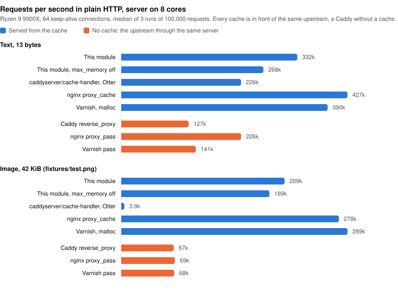
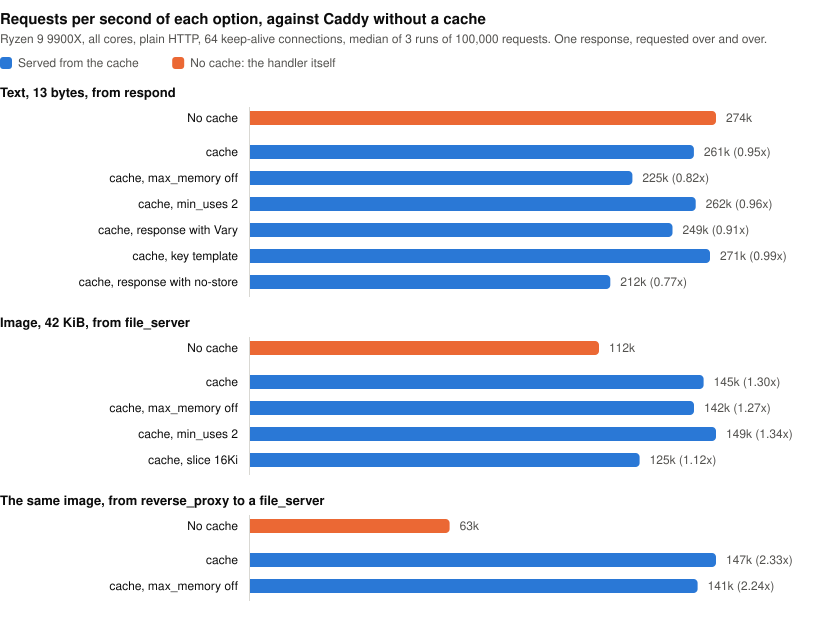

Caddy Module: http.handlers.cache
================================

A streaming HTTP cache for Caddy, forked from [caddyserver/cache-handler](https://github.com/caddyserver/cache-handler).

It works like nginx's `proxy_cache`: responses are files in a directory of bounded size, and the most requested ones are also kept in memory, within a strict budget. Responses stream in and out of the cache and are never held whole in memory.

> [!IMPORTANT]
> This is not a drop-in replacement for [caddyserver/cache-handler](https://github.com/caddyserver/cache-handler). That module is built on [Souin](https://github.com/darkweak/souin) and its pluggable storage backends; this one has a single built-in storage and drops the features that depended on them. **Stay on the original if you need:**
>
> * **A cache shared by several Caddy instances.** Souin can store in Redis, etcd, NATS or Olric. Here each instance has its own cache on its own disk.
> * **Purging by tag.** Souin groups responses under surrogate keys (`Surrogate-Key`, `Cache-Tags`…) and can propagate purges to a CDN. Here a purge is by key, prefix or regular expression.
> * **ESI.** `<esi:include>` tags are not processed.
> * **Caching `POST` or GraphQL.** Only `GET` is cached.
> * **A storage of your choice**, such as in-memory only (Otter) or an embedded database (Badger, NutsDB).
> * **Prometheus metrics.** Counters are served as JSON by the admin endpoint.
> * **A track record.** Souin has years of production use and is tested against the HTTP caching conformance suite. This module is new.
>
> This module is the better fit for large or numerous responses on a server with finite memory: images, video, downloads, an object storage behind a reverse proxy.

## Comparison

| | This module | [caddyserver/cache-handler](https://github.com/caddyserver/cache-handler) (Souin) | nginx `proxy_cache` |
|---|---|---|---|
| Storage | Files on disk, hottest responses in memory. Built in. | Pluggable: Badger, NutsDB, Otter, SimpleFS, Redis, etcd, NATS, Olric, each a separate module; an in-memory map without one. | Files on disk; RAM through the kernel's page cache. |
| Disk limit | `max_size` and `max_file_count`, enforced, downloads in progress included. | Depends on the storage. | `max_size`, enforced periodically. |
| Memory limit | `max_memory`, enforced: index and in-memory responses, outside the Go heap. | None: each response in transit is buffered whole, several times over. Default storage unbounded. | `keys_zone` for the index; the page cache is the kernel's. |
| Response bodies | Streamed through the cache file; tens of kilobytes of buffer per request, whatever the size. | Buffered whole before the first byte, and again on every hit. | Streamed through a temporary file. |
| Large files | Bounded by disk only. | Bounded by RAM, times concurrent requests. | Fine. |
| Concurrent misses | One upstream request; the others are served from it as it arrives. | One upstream request; the others wait for the complete response. | With `proxy_cache_lock`, the others wait for completion or a timeout. |
| `Range` on a miss | Streamed as the response arrives, whole response stored. With `slice`, only the slices covering the range. | Served once fully buffered. | Whole response fetched; the `slice` module caches ranges individually. |
| Client disconnects | Download continues and is stored, if its length is known. | Download aborted, nothing stored. | Download continues and is stored. |
| Expired responses | Revalidated conditionally; optionally served stale meanwhile or on error. | Revalidated; optionally served stale. | Refetched, or revalidated with `proxy_cache_revalidate`; optionally served stale. |
| Restart | Cache kept, usable at once. | Depends on the storage. | Cache kept. |
| Responses requested once | `min_uses 2`: kept in memory, never written to disk. | Written to the storage. | `proxy_cache_min_uses 2`: not cached; the second request goes upstream too. |
| Shared between instances | No. | With a distributed storage. | No. |
| Purge | Key, prefix or regular expression, on the admin endpoint. | Key, regular expression or surrogate key, with CDN propagation. | Commercial version or third-party modules. |
| Cached methods | `GET` (and `HEAD` from it). | Configurable, including `POST` with the body in the key. | Configurable. |
| ESI, GraphQL | No. | Yes. | SSI. |
| Request `Cache-Control` | Ignored unless `mode strict`. | Honored. | Ignored. |
| Metrics | JSON on the admin endpoint. | Prometheus. | `$upstream_cache_status` in logs. |
| Maturity | New. | Years in production. | Decades. |

Known limits, besides the notice above:

* Without `slice`, a large file is downloaded from its beginning: a request for a range far into an uncached response waits for the download to reach it. See [Slices](#slices).
* The request that triggers a download is held open until the download ends, even if its range ends earlier. Its bytes are sent as they arrive; other requests are not affected. With `slice`, it waits for the end of its slice only.
* Slices are fetched one after the other, as the client reads, never ahead.
* Only responses that announce their length are served from a download in progress. Others wait for the complete response.
* The cache directory belongs to one Caddy process.
* Linux, macOS and the BSDs only, see [Platform notes](#platform-notes).

## Features

* Two bounded tiers: `max_size` on disk, `max_memory` in RAM, and optionally `max_file_count`.
* Responses stream to the client and to the cache at once. No body is ever buffered whole.
* Requests arriving during a download are served from it as it arrives: one upstream request, and nobody waits for the end to get the beginning.
* A `Range` request for an uncached response is streamed as the response arrives, while the whole is stored.
* Optional slices (`slice`), like nginx's `slice` module: seeking into an uncached video fetches what is watched, not everything before it.
* A download continues when its client disconnects.
* Survives restarts and crashes: files are written atomically and the index is rebuilt from them in the background.
* Optional `min_uses`: a response is written to disk only once requested again, and served from memory until then. Responses requested once cost no disk write.
* Expired responses are revalidated with `If-None-Match` / `If-Modified-Since`, and can be served stale while updating or when the upstream fails.
* `Range`, `If-None-Match`, `If-Modified-Since` and `HEAD` requests are answered from the cache.
* `Vary`, with `Accept-Encoding` normalized so that compressed variants are not multiplied.
* [`Cache-Status`](https://www.rfc-editor.org/rfc/rfc9211) and `Age` response headers.
* Follows [RFC 9111](https://www.rfc-editor.org/rfc/rfc9111), to the letter with `mode strict`, see [Standards compliance](#standards-compliance).
* Statistics and purge on Caddy's admin endpoint.

## Building

```sh
xcaddy build --with github.com/Meow/cache-handler
```

No other module is needed. Caddy 2.11.7 or later is required, which takes Go 1.26 or later to build. `xcaddy` builds with the latest Caddy release unless told otherwise.

## Minimal configuration

```caddy
{
    cache {
        ttl 24h
        max_memory 8Gi
        max_size 25Gi
    }
}

example.com {
    cache
    reverse_proxy your-app:8080
}
```

The `cache` directive is ordered before `rewrite`. The global `cache` block is optional: it sets the defaults every directive inherits.

## Options

The global option and the directive take the same options. A directive inherits from the global option whatever it does not set itself.

```caddy
cache [<matcher>] {
    path /var/cache/caddy
    max_size 25Gi
    max_memory 8Gi
    max_file_count 1000000
    inactive 30d
    min_uses 2
    slice 16Mi

    ttl 24h
    stale 1h
    lock_timeout 5s
    mode strict
    cache_name Caddy
    default_cache_control "public, max-age=3600"
    max_cacheable_body_bytes 1Gi
    allowed_additional_status_codes 404 410

    key {
        disable_host
        disable_method
        disable_query
        disable_scheme
        disable_vary
        sort_query
        headers Authorization X-Tenant
        template {http.request.uri.path}
        hide
    }
    regex {
        exclude ^/admin/
    }
}
```

| Option | Default | Description |
|---|---|---|
| `path` | `cache` in Caddy's data directory | Directory of the stored responses. Directives with the same directory share one cache. One Caddy process per directory. |
| `max_size` | `10Gi` | Disk space the cache may take. Least recently used responses are evicted to stay under it. |
| `max_memory` | `256Mi` | RAM the cache may take, for its index and the most requested responses. `off` keeps responses on disk only. |
| `max_file_count` | none | Number of files the cache may hold, evicting least recently used responses to stay under it. For filesystems that run out of inodes before space. |
| `inactive` | none | Removes responses not requested for this long, fresh or not. |
| `min_uses` | `1` | Requests after which a response is written to disk. With `2` or more, a response stays in memory only until then, and is lost if Caddy stops first. See [Requested once](#requested-once). Not available with `max_memory off`. |
| `slice` | `off` | Size of the ranges a response is fetched and stored in, so that a request for part of a large response fetches that part only. See [Slices](#slices). The upstream must support `Range`. At least `4Ki`, at most half of `max_size`. |
| `ttl` | `120s` | Freshness of a response that does not say (no `max-age` / `s-maxage`, no `Expires`). |
| `stale` | `0` | How long past its freshness a response may be served while it is updated, or when the upstream fails. Overridden by `stale-while-revalidate` and `stale-if-error` in the response. |
| `lock_timeout` | `5s` | How long a request waits for another request's upstream to start answering, before going upstream itself. |
| `mode` | | Which `Cache-Control` directives are honored. By default the responses' but not the requests': a client cannot force its way past the cache. `strict` also honors the requests' (`no-cache`, `no-store`, `max-age`, `min-fresh`, `max-stale`, `only-if-cached`, `Pragma: no-cache`) and stores a response to a request with `Authorization` only with `public`, `s-maxage` or `must-revalidate`: the mode that conforms to RFC 9111, see [Standards compliance](#standards-compliance). `bypass_response` ignores the responses' and caches everything for `ttl`. `bypass` and `bypass_request` are aliases of `bypass_response` and of the default. |
| `cache_name` | `Caddy` | Name of the cache in `Cache-Status`. |
| `default_cache_control` | | `Cache-Control` given to responses that have none. |
| `max_cacheable_body_bytes` | half of `max_size` | Responses with a larger body are relayed, not stored. For a sliced response this is its whole size, with no default. |
| `allowed_additional_status_codes` | | Status codes cached for `ttl`, besides 200, 203, 204, 300, 301 and 308. |
| `key` | | Tunes the cache key, see [Cache key](#cache-key). |
| `regex` `exclude` | | Requests whose URI matches are not cached. |

`max_size`, `max_memory`, `max_file_count` and `inactive` belong to the directory: two directives with the same `path` cannot disagree on them. Set them once in the global option, or give each cache its own `path`.

Sizes are bytes, or a number with a unit: `k`, `m`, `g`, `t` and `Ki`, `Mi`, `Gi`, `Ti` are powers of 1024, `KB`, `MB`, `GB`, `TB` powers of 1000.

In JSON, the handler is `{"handler": "cache", ...}` and the global options are the `cache` app, with the same names.

## How it works

### Storage

Every stored response is one file under `path`, written to a temporary file and renamed into place when complete. A file is always whole: a crash or an interrupted download leaves only a temporary file, deleted at the next start. Files are never modified afterward.

The index is kept in memory and rebuilt at start by reading the directory in the background. Meanwhile, requests find unindexed files directly on disk, so the cache is warm immediately.

A response requested at least twice in a few minutes is copied to memory, if it is requested more than the response it would push out. Memory is an accelerator, never the only copy, unless `min_uses` says otherwise.

### Requested once

On most sites, most stored responses are requested once and never again. Writing them to disk wears it and competes with the reads that serve popular responses, for nothing. Cloudflare [observed](https://blog.cloudflare.com/why-we-started-putting-unpopular-assets-in-memory/) the same on its own cache, and `min_uses` applies the same remedy.

With `min_uses 2`, a new response is stored in memory only. Its second request is served from memory, and the response is then written to disk, where it stays like any other. Without a second request, it is dropped from memory when later responses need the room, having never touched the disk. A higher value waits for more requests. Requests served from the response while it downloads count.

Unlike nginx's `proxy_cache_min_uses`, the response is cached from its first request: the second is a hit, not another trip upstream. That holds for as long as memory keeps the response. Responses waiting for their next request share half of `max_memory`, least recently requested first out. A dropped response is remembered for a few bytes: when requested again it is fetched again, but written to disk this time. So a response requested twice is usually fetched once, and twice at worst, as it always is by nginx. Only a response gone long enough to be forgotten starts over.

Some responses go to disk at their first request as if `min_uses` were unset: those larger than an eighth of `max_memory`, those arriving while all the memory they may use is taken by other downloads, and new versions of a response already on disk.

Memory does not survive Caddy stopping: after a restart, a response requested once is fetched again. A configuration reload keeps everything.

### Limits

`max_size` covers the cache files and the downloads in progress. When a response does not fit, the least recently used ones are deleted. A response larger than half of `max_size` (or than `max_cacheable_body_bytes`) is not stored.

`max_file_count` counts one file per stored response, one more per URL whose responses vary (it records which request headers select them), and one per download in progress. A sliced response is one file per slice plus one for the URL. A download that would exceed the limit evicts the least recently used response first. The cache directory also holds up to 258 directories and two small files of its own, not counted.

`max_memory` covers the index (about 200 bytes plus the key per file) and the bodies and headers kept in memory. Bodies live outside the Go heap, in memory mapped for the purpose and returned to the system when the budget shrinks, so they do not burden the garbage collector. When the index alone approaches the budget, which takes millions of files, the least recently used files are removed. With `min_uses`, memory-only responses take at most half of the budget, headers included, and one body at most an eighth; copies of what is on disk make room for them.

Not counted: a few tens of kilobytes of buffers per request in progress, whatever the response size.

### Fetching

On a miss, the response is written to the cache as fast as the upstream sends it, and the client is served from the cache file as it fills, from the first bytes. A slow client, or one that stops reading, delays nobody.

Other requests for the same response do not go upstream. They wait, up to `lock_timeout`, for the upstream to start answering the first one, then are served from the same file as it fills: a second viewer starts watching during the first download, and a range request gets its range as soon as the download reaches it. This applies to responses with a `Content-Length`. For the others, which could turn out too large to keep, the other requests wait for the complete response, and go upstream themselves after `lock_timeout`.

When a response turns out not to be cacheable, the waiting requests are released at once, and for a minute requests for it do not wait at all. During that minute, requests with a range or a precondition go straight upstream as they are.

Unless [slices](#slices) are used, the upstream is always asked for the whole response. The request that triggers the download gets the range it asked for as the download reaches it. If it carries a precondition (`If-None-Match`…) or asks for several ranges, the response is stored first and the request answered from it.

If the client disconnects, the download continues for the next requests, provided the response announced its length and the upstream keeps sending. A response of unknown length is given up when its last listener leaves.

If a download fails midway, nothing is stored, and the requests served from it are cut short rather than given a truncated response as complete. If a response can no longer be stored while downloading, for lack of space for instance, the client that triggered it still gets all of it.

### Slices

By default the upstream is asked for whole responses. That is the best use of a cache, one request and one file per response, until someone jumps to the middle of a two hour video nobody watched before: the download starts at the first byte, and the viewer waits.

With `slice 16Mi`, the upstream is asked for the response 16MiB at a time with `Range` requests, and each slice is stored by itself. A request is answered from the slices that hold what it asks for, from the cache or fetched as the client reaches them. A range fetches only the slices it is in, and a response nobody reads to the end is not downloaded to the end. This is what nginx's `slice` module does.

The client sees none of it: it gets the status, headers and length of the whole response or of its range, and `Range`, `If-Range`, preconditions and `HEAD` are answered as without slices.

What the previous section says of a response holds for each slice: one upstream request however many clients want it, all served while it downloads, and a download that outlives its client. That one now ends with the slice: the next ones are not fetched for a client that is gone. `min_uses` counts requests per slice, and each slice expires and is revalidated by itself.

Not everything is stored in slices:

* A response that fits in its first slice is stored whole, exactly as without `slice`. Small files cost nothing more than a `Range` header on the request.
* So is the response of an upstream that ignores `Range` and sends everything, and any response that is not a `206`: an error, a redirect.
* So is a response transformed between the cache and the upstream, by compression for instance: ranges of what the upstream sent are not ranges of what the client gets. The cache notices when the first slice arrives without its length and asks again for the whole response, so the first request costs the upstream two. The untransformed variant, for clients that do not accept compression, is stored in slices beside it.

Caddy's own `encode` leaves the response to a `Range` request alone, and with `slice` that is every response of an upstream that supports ranges. Placed after the cache, where it goes unless a `route` block says otherwise, it compresses nothing from such an upstream: responses are stored and served as sent. To compress them, put `encode` in front of the cache. It then compresses what the cache serves, each time, and leaves ranges alone:

```caddy
route {
    encode zstd gzip
    cache
    reverse_proxy your-app:8080
}
```

Slices of a response must be parts of the same thing. They are compared by `ETag`, `Last-Modified` and total size with the first one sent to the client. When a file changes upstream while the cache holds slices of it, a response that would mix versions is cut short instead, and every slice stored for the URL is discarded, so the next request gets the new version. Give responses an `ETag` or `Last-Modified`: without them, two versions of the same size cannot be told apart.

Choosing the size: a slice is one upstream request and one file, counted in `max_file_count`. Slices are fetched one after the other as the client reads, so small ones mean many round trips. Large ones fetch more before the byte a range starts at, and after the last byte a departed client wanted. `1Mi` to `16Mi` suits most uses. Changing the size makes stored slices useless: they are no longer served, and leave the cache as space is needed.

A sliced response can be larger than half of `max_size`, and larger than the cache: its least recently read slices make room for the next. `max_cacheable_body_bytes`, when set, applies to its whole size.

The size of a response is kept only in its slices. A range starting past the end is therefore sent upstream, which answers that it has no such range, before the client is told so.

### Expiry

A response is fresh for `Cache-Control: s-maxage` or `max-age`, failing that until `Expires`, failing that for `ttl`. Its age on arrival is the greater of its `Age` header and the time since its `Date`, and is taken off its freshness: a response already a minute old at an upstream cache, or from an upstream whose clock is a minute behind, has a minute less to live here. `Age` on a served response is that age plus time spent in the cache.

A stale response is not discarded. The next request revalidates it: the upstream gets the stored `ETag` and `Last-Modified`, and on `304 Not Modified` the stored response is fresh again without being transferred. Otherwise the new response replaces it.

With `stale` set, the other requests arriving during the update are served the stale response at once, and so is a failure of the upstream (an error before the response, or a 5xx). Responses marked `must-revalidate`, `proxy-revalidate` or `no-cache` are never served stale.

### What is cached

Only `GET` requests fill the cache; `HEAD` requests are answered from it. A response is stored unless:

* its status is not one of 200, 203, 204, 300, 301, 302, 307, 308, 404, 405, 410, 414, 501 or of `allowed_additional_status_codes`;
* it does not say how long it is fresh and its status is not one `ttl` applies to;
* it has `Cache-Control: no-store` (unless `must-understand` is there too, as the status is one the cache understands) or `private`;
* it has `Set-Cookie`, or `Vary: *`;
* the request had `Authorization` and the response has none of `public`, `s-maxage`, `must-revalidate`. Without `mode strict`, the response is stored anyway when `Authorization` is in its `Vary` or in the `key` `headers`, as the credentials then select it;
* it is already expired and has no `ETag` or `Last-Modified` to revalidate with;
* its body is larger than what may be stored;
* it announces trailers, or is a `text/event-stream`.

A successful request of any method but `GET`, `HEAD`, `OPTIONS` and `TRACE` removes the response stored for its URI, and those for the URIs its response names in `Location` and `Content-Location` on the same host.

The cache stores what the handlers after it produce. Headers set by a directive before it, such as `header Cache-Control "public, max-age=31536000"` for browsers, go on every response, cached or not: they are not stored and do not decide how long a response is kept.

## Standards compliance

The caching rules are those of [RFC 9111](https://www.rfc-editor.org/rfc/rfc9111) (HTTP Caching, obsoleting RFC 7234), `Cache-Status` follows [RFC 9211](https://www.rfc-editor.org/rfc/rfc9211), and `stale-while-revalidate` and `stale-if-error` follow [RFC 5861](https://www.rfc-editor.org/rfc/rfc5861). The module is a *shared cache* in the RFC's sense.

By default the module favors hit rate where the RFC leaves a choice, and in two places where it does not. `mode strict` removes those two differences, and [examples/Caddyfile-rfc9111](examples/Caddyfile-rfc9111) is a conforming configuration:

| | Default | `mode strict` | RFC 9111 |
|---|---|---|---|
| Request `Cache-Control` (`no-cache`, `no-store`, `max-age`, `min-fresh`, `max-stale`, `only-if-cached`) and `Pragma: no-cache` | Ignored, as by nginx and Varnish: a client cannot force its way past the cache. | Honored. | Section 4 requires validation for `no-cache`; section 5.2.1 makes the other request directives advisory. |
| Response to a request with `Authorization` | Stored with `public`, `s-maxage` or `must-revalidate`, or when `Authorization` is in `Vary` or the `key` `headers`: the credentials are then part of the key. | Stored with `public`, `s-maxage` or `must-revalidate` only. | Section 3.5 allows the directives only. |

Choices the RFC leaves to the cache, whatever the mode:

* **Heuristic freshness** (section 4.2.2) is the `ttl` option: a fixed duration rather than a fraction of the `Last-Modified` age, applied to 200, 203, 204, 300, 301 and 308 responses, which the RFC lists as heuristically cacheable, and to `allowed_additional_status_codes`. It can be shortened, not turned off.
* **Serving stale** (section 4.2.4) is allowed by the response's `stale-while-revalidate` and `stale-if-error`, by the request's `max-stale` in `mode strict`, and by the `stale` option, which the RFC admits as "configuration in accordance with an out-of-band contract" with the origin. A stale response is served to requests arriving while one request updates it; the request that first finds it stale waits for the origin rather than triggering a background update.
* **Invalidation** (section 4.4) applies to every method not known to be safe and to the `Location` and `Content-Location` URIs on the same host, which the RFC permits but does not require.
* **Stricter than required**: responses with `Set-Cookie`, with trailers, `text/event-stream` and partial (206) upstream responses are not stored; `no-cache` and `private` with field names are treated as bare; of several `Cache-Control` directives of one name, the first counts. Refusing to store never breaks conformance.
* **Normalization** of `Accept-Encoding` for `Vary` (section 4.1) keeps `gzip`, `br`, `zstd`, `deflate` and `*`, sorted.
* `Warning` headers, which RFC 7234 recommended on stale and heuristically fresh responses, are not generated: RFC 9111 deprecates them.
* `must-understand` (section 5.2.2.3) lifts `no-store` for the status codes the cache understands, which are the only ones it stores.

Outside the RFC by design: `mode bypass_response` ignores the responses' directives; `default_cache_control` speaks for an origin that says nothing; `key { disable_vary }` and `key { template }` change what a stored response answers.

The [http-tests/cache-tests](https://github.com/http-tests/cache-tests) conformance suite can be run against the module: see [fixtures/cache-tests](fixtures/cache-tests/README.md).

## Cache key

The default key is `METHOD-SCHEME-HOST-PATH?QUERY`, for instance `GET-https-example.com-/logo.png?v=2`. The path is taken as sent, percent-encoding included. A different key is a different stored response, so the key should contain what makes the response different and nothing else.

| `key` option | Effect |
|---|---|
| `disable_host`, `disable_method`, `disable_scheme` | Leaves that part out. |
| `disable_query` | Leaves the query out: `/a?x=1` and `/a?x=2` are one response. |
| `sort_query` | Sorts the query: `/a?x=1&y=2` and `/a?y=2&x=1` are one response. |
| `headers` | Adds these request headers, as `-Name="value"`. |
| `template` | Replaces the key. Caddy placeholders are supported. Use parts that cannot be mistaken for one another: with `{path}-{query}`, `/a-b` and `/a?b` are one key. |
| `disable_vary` | Ignores the responses' `Vary`. |
| `hide` | Leaves the key out of `Cache-Status`. |

The key is computed before the request is rewritten. When several URLs are rewritten to one upstream object, build the key from what identifies the object so that they share one stored response:

```caddy
@image path_regexp image ^/img/download/(.+)/([0-9]+).*\.([A-Za-z0-9]+)$
cache @image {
    key {
        template {re.image.1}/{re.image.2}.{re.image.3}
    }
}
rewrite @image /bucket/images/{re.image.1}/{re.image.2}/full.{re.image.3}
reverse_proxy s3.example.com
```

Responses with `Vary` are stored once per combination of the request headers listed. An upstream that sends `Vary: Origin` to every browser, as object storages with CORS do, makes one copy per origin: use `disable_vary` if the response does not actually depend on it.

## The Cache-Status header

| Value | Meaning |
|---|---|
| `Caddy; hit; ttl=3541; detail=MEMORY` | Served from memory, fresh for 3541 more seconds. |
| `Caddy; hit; ttl=3541; detail=DISK` | Served from disk. |
| `Caddy; hit; ttl=-12; detail=UPDATING` | Served stale while another request updates it. |
| `Caddy; fwd=uri-miss; stored` | Fetched and stored. |
| `Caddy; fwd=uri-miss; collapsed` | Served from another request's download. |
| `Caddy; fwd=uri-miss; detail=<REASON>` | Fetched, not stored: `NO-STORE`, `PRIVATE`, `SET-COOKIE`, `VARY-STAR`, `AUTHORIZATION`, `UNCACHEABLE-STATUS`, `EXPIRED`, `TOO-LARGE`, `TRAILER`, `EVENT-STREAM`, `UNCACHEABLE` (found so less than a minute ago), `HEAD`, `LOCK-TIMEOUT`, `CLIENT-GONE`, `STORAGE-ERROR`. |
| `Caddy; fwd=stale; fwd-status=304; detail=REVALIDATED` | Expired, confirmed by the upstream, served from the cache. |
| `Caddy; fwd=stale; stored` | Expired, replaced by a new response. |
| `Caddy; fwd=stale; fwd-status=503; detail=STALE` | Expired, served anyway because the upstream failed. |
| `Caddy; fwd=bypass; detail=<REASON>` | Not handled: `UNSUPPORTED-METHOD`, `EXCLUDED`, `INVALID-KEY`, `REQUEST-NO-STORE`, `ONLY-IF-CACHED`, `UNAVAILABLE`. |

The key follows as `; key=...` unless hidden.

For a sliced response, the header describes the first slice sent to the client. Later slices may have been fetched when it says `hit`, and the other way around.

## Admin API

The cache is observed and purged through [Caddy's admin endpoint](https://caddyserver.com/docs/api), `localhost:2019` by default.

```sh
# State of the caches: entries, bytes on disk and in memory, hits, misses, evictions…
# With min_uses: transient_entries are in memory only, persisted counts the responses
# written to disk at a later request, dropped those that never were.
curl localhost:2019/cache/stats

# Remove the response stored for a key, as shown in Cache-Status, with its
# variants and slices
curl -X POST 'localhost:2019/cache/purge?key=GET-https-example.com-/logo.png'

# Remove the responses whose key starts with a prefix, or matches a regular expression
curl -X POST 'localhost:2019/cache/purge?prefix=GET-https-example.com-/img/'
curl -X POST --data-urlencode 'regex=\.css$' -G 'localhost:2019/cache/purge'

# Empty the caches
curl -X POST 'localhost:2019/cache/purge?all=true'
```

With several caches, add `path=<directory>` to purge one only.

## Performance

Over TLS, which is how responses reach browsers, this module serves about three quarters of the requests per second nginx's `proxy_cache` does, a little more than Varnish, and far more than the module it is forked from on anything larger than a few bytes. A hit costs about what Caddy takes to produce a trivial response itself, and much less than asking an upstream.

### Compared with other caches

[`bench/compare.sh`](bench/compare.sh) puts this module, [caddyserver/cache-handler](https://github.com/caddyserver/cache-handler), nginx and Varnish in front of the same upstream, a Caddy without a cache, and measures hits with `ab` (ApacheBench) over 64 keep-alive connections. It runs in Docker, each process pinned to its own cores, and measures over TLS and in plain HTTP. Varnish has no TLS of its own and gets it from hitch, the Varnish project's TLS proxy, on the same cores.

Results on a Ryzen 9 9900X running Fedora 44 (Linux 7.2, Docker 29.8), servers on 8 cores, median of 3 runs of 100000 requests, in requests per second.

Over TLS, `sendfile` off:


| | Text, 13 bytes | Image, 42KiB |
|---|---:|---:|
| **This module** | 210243 | 97346 |
| **This module**, `max_memory off` | 194458 | 94711 |
| caddyserver/cache-handler, default storage | 176943 | 3999 |
| caddyserver/cache-handler, Otter | 178316 | 3922 |
| caddyserver/cache-handler, SimpleFS | 117753 | 4181 |
| nginx `proxy_cache` | 278627 | 128702 |
| Varnish, malloc storage, behind hitch | 198052 | 86714 |
| *No cache, for reference:* | | |
| Caddy `respond` / `file_server` | 225112 | 102876 |
| Caddy `reverse_proxy` | 111536 | 61857 |
| nginx `return` / static file | 278761 | 127150 |
| nginx `proxy_pass` | 205497 | 69756 |
| Varnish `pass`, behind hitch | 106563 | 61875 |

Plain HTTP, where nginx and Varnish are not slowed by encryption:



| | Text, 13 bytes | Image, 42KiB |
|---|---:|---:|
| **This module** | 332322 | 208823 |
| **This module**, `max_memory off` | 268348 | 189388 |
| caddyserver/cache-handler, default storage | 224252 | 3937 |
| caddyserver/cache-handler, Otter | 226133 | 3905 |
| caddyserver/cache-handler, SimpleFS | 142792 | 4287 |
| nginx `proxy_cache` | 427208 | 278306 |
| Varnish, malloc storage | 389730 | 289311 |
| *No cache, for reference:* | | |
| Caddy `respond` / `file_server` | 386819 | 132051 |
| Caddy `reverse_proxy` | 127044 | 67036 |
| nginx `return` / static file | 447139 | 278241 |
| nginx `proxy_pass` | 226222 | 68572 |
| Varnish `pass` | 140740 | 67653 |

* Over TLS, encryption is a large part of every server's work and the differences shrink: on the image, this module serves 76% of what nginx does and 12% more than Varnish behind hitch. In plain HTTP, nginx and Varnish serve the image from the page cache or their own memory with less copying than a Go program can, and are 1.3 to 1.4 times as fast.
* A hit costs about what Caddy itself takes to answer: within 15% of `respond` on the text; on the image within 6% of `file_server` over TLS, and well ahead of it in plain HTTP, where `file_server` copies the file in user space and the cache does not.
* caddyserver/cache-handler keeps up on 13 bytes and falls to about 4000 requests per second on 42KiB, whatever its storage.
* `max_memory off` costs 3% to 19%: a response read from disk is sent with `sendfile` and pays for opening its file.
* `ab` is a single thread on one core, and with 8 cores the fastest rows hit its limit as much as the server's: nginx's `return` and `proxy_cache` come out alike on the text, about 279000 requests per second over TLS, most likely ab's ceiling.

### Options

[`bench/bench.sh`](bench/bench.sh) measures this module alone, in plain HTTP on all cores, over the scenarios of [`bench/Caddyfile`](bench/Caddyfile): what each option costs against Caddy without a cache. Same machine, median of 3 runs of 100000 requests:



| | Requests/s | vs. no cache | p50 | p99 | Served from |
|---|---:|---:|---:|---:|---|
| **A text of 13 bytes, from `respond`** | | | | | |
| No cache | 274133 | | 0.20 ms | 0.78 ms | |
| `cache` | 261105 | 0.95x | 0.20 ms | 0.84 ms | Memory |
| `cache`, `max_memory off` | 224961 | 0.82x | 0.22 ms | 1.06 ms | Disk |
| `cache`, `min_uses 2` | 262198 | 0.96x | 0.20 ms | 0.81 ms | Memory |
| `cache`, response with `Vary` | 248554 | 0.91x | 0.21 ms | 0.89 ms | Memory |
| `cache`, `key` `template` | 270599 | 0.99x | 0.20 ms | 0.81 ms | Memory |
| `cache`, response with `no-store` | 211973 | 0.77x | 0.22 ms | 1.21 ms | Not stored |
| **An image of 42KiB, from `file_server`** | | | | | |
| No cache | 111867 | | 0.46 ms | 1.80 ms | |
| `cache` | 145372 | 1.30x | 0.40 ms | 1.07 ms | Memory |
| `cache`, `max_memory off` | 142295 | 1.27x | 0.40 ms | 1.19 ms | Disk |
| `cache`, `min_uses 2` | 149360 | 1.34x | 0.39 ms | 1.04 ms | Memory |
| `cache`, `slice 16Ki` | 124863 | 1.12x | 0.45 ms | 1.36 ms | Memory, 3 slices |
| **The same image, from `reverse_proxy` to a `file_server`** | | | | | |
| No cache | 62817 | | 0.78 ms | 3.35 ms | |
| `cache` | 146645 | 2.33x | 0.39 ms | 1.10 ms | Memory |
| `cache`, `max_memory off` | 140865 | 2.24x | 0.40 ms | 1.18 ms | Disk |

* A response served from memory costs a few percent against `respond`, within the noise of a run, and is 30% faster than `file_server`.
* `max_memory off` costs 14% on the text and 2% on the image.
* A response that varies takes a second lookup, 5%. One stored in slices is assembled from several, 14% against one stored whole.
* A response that cannot be stored passes through the cache at a cost, 23% here against a handler that does next to nothing, where it shows most.
* In front of a reverse proxy, the cache answers 2.3 times the requests the upstream does, and that upstream is as fast and close as one can be: Caddy's own `file_server`, on the same machine.

Read these numbers with care. `ab` runs on the same machine and competes for the processor. Single runs differ by 10% or so, hence the median, and a few percent between two rows means nothing. What is measured is one response requested over and over: no storing of new responses, no network.

To run them yourself, `bench.sh` needs Go and `ab`, `compare.sh` needs Docker:

```sh
bench/bench.sh
bench/compare.sh
```

## Coming from nginx

| nginx | Here |
|---|---|
| `proxy_cache_path /var/www/cache` | `path /var/www/cache` |
| `max_size=25000m` | `max_size 25000m`. `max_file_count` also exists; nginx has no file limit. |
| `keys_zone=name:8m` | Not needed: the index is part of `max_memory`. |
| `inactive=720m` | `inactive 720m` |
| `proxy_cache_min_uses 2` | `min_uses 2`. The response is kept in memory until its second request instead of not cached, see [Requested once](#requested-once). |
| `levels=1:2`, `use_temp_path=off` | Not needed. |
| `proxy_cache_valid 6h` | `ttl 6h`. Add `allowed_additional_status_codes 302` for the same statuses. |
| `proxy_cache_key $request_filename` | `key { template ... }`, see [Cache key](#cache-key). |
| `proxy_cache_lock on` | Always on, and waiting requests are served from the download in progress instead of after it. `proxy_cache_lock_timeout` is `lock_timeout`. |
| `slice 1m`, `proxy_set_header Range $slice_range`, `$slice_range` in `proxy_cache_key`, `proxy_cache_valid 206` | `slice 1m`, nothing else. Responses that fit in one slice are stored whole, and slices of different versions are never mixed, see [Slices](#slices). |
| `proxy_cache_revalidate on` | Always on. |
| `proxy_cache_use_stale updating error timeout http_5xx` | `stale <duration>` |
| `proxy_cache_background_update on` | With `stale`, one request waits for the update and the others are served stale meanwhile. |
| `proxy_ignore_headers Cache-Control Expires` | `mode bypass_response` |
| `proxy_cache_bypass`, `proxy_no_cache` | A matcher on the `cache` directive, or `regex { exclude }`. |
| `$upstream_cache_status` | The `Cache-Status` response header. |

What nginx leaves to the kernel's page cache, serving hot files from RAM, is done here explicitly within `max_memory`. Files not in memory are still served through the page cache, as by nginx.

## Migrating from caddyserver/cache-handler

Check the notice at the top first: some features of the original have no equivalent here.

The storage backends are gone, and with them the need to build Caddy with a storage module: remove `badger`, `etcd`, `nats`, `nuts`, `olric`, `otter`, `redis`, `simplefs` and `storers` from the configuration and set `path`, `max_size` and `max_memory` instead. A configuration that still uses a removed option is refused with a message saying what to use instead.

| Removed | Instead |
|---|---|
| Storage providers, `storers` | `path`, `max_size`, `max_memory`. The cache is local to one Caddy instance. |
| `api` | Always available on the admin endpoint, under `/cache/`. |
| `cache_keys` | One `cache` directive per matcher, each with its `key` block. |
| `headers` | `key { headers ... }` |
| `timeout` | The timeouts of `reverse_proxy`. |
| `allowed_http_verbs`, `key { disable_body }` | Only `GET` and `HEAD` are cached. |
| `cdn`, surrogate keys, ESI | Not supported. |
| `log_level` | Caddy's `log` option. |
| `key { hash }` | Not needed: keys are always hashed on disk. |

Other differences:

* Request `Cache-Control` directives are ignored unless `mode strict` is set, see [Standards compliance](#standards-compliance).
* 404, 405, 410, 414 and 501 responses are only cached when they say for how long, or when listed in `allowed_additional_status_codes`.
* `Cache-Status` names the cache `Caddy` and has different details, see above.
* The admin API moved from `/souin-api` to `/cache`.

## Platform notes

Linux, macOS and the BSDs are supported. On Linux, memory the cache gives up is returned to the system at once; on macOS and the BSDs the system takes it back when it needs it, so the resident size of the process may stay above what the cache uses for a while.

Windows is not supported. The module builds there, but the cache replaces and deletes files that are being read, which Windows refuses: responses could not be refreshed while served.

## Versions

This module starts at 1.0.0. It shares its history with caddyserver/cache-handler up to that project's 0.17.0, but is a different module with a different configuration, not a continuation of that numbering. See [CHANGELOG.md](CHANGELOG.md).

## Credits and license

This project is a fork of [caddyserver/cache-handler](https://github.com/caddyserver/cache-handler), written by [Sylvain Combraque (darkweak)](https://github.com/darkweak), the author of [Souin](https://github.com/darkweak/souin), with contributions from Kévin Dunglas, Antoine Bluchet, Burak Sezer, Frederic Houle, Malloc Voidstar, Matthew Holt, Po Chen and Sherif Metwally. The Caddy integration, the configuration syntax and most option names come from their work, and Souin remains the reference for what an HTTP cache for Caddy should do.

The idea of serving every request from a response while it is still being downloaded comes from [cache_streamer](https://github.com/liamwhite/cache_streamer).

Like the original, this module is distributed under the [Apache License 2.0](LICENSE). The changes made to the original are summarized in [NOTICE](NOTICE).
